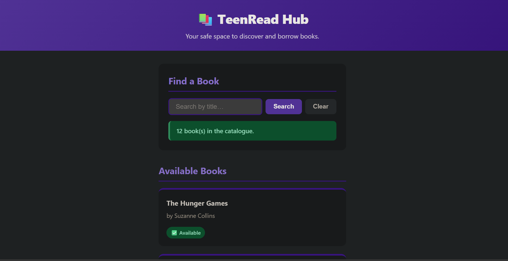
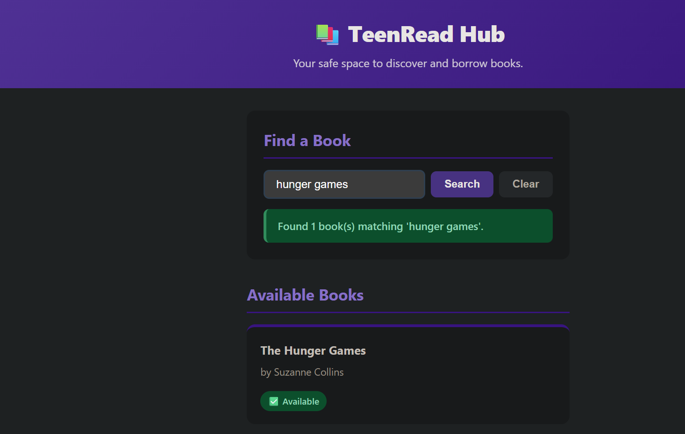
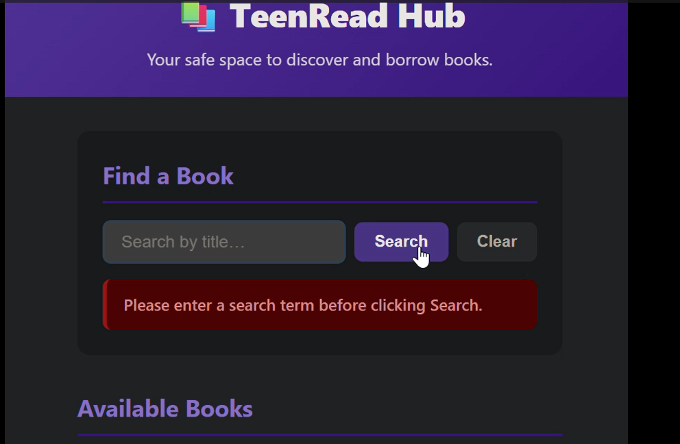
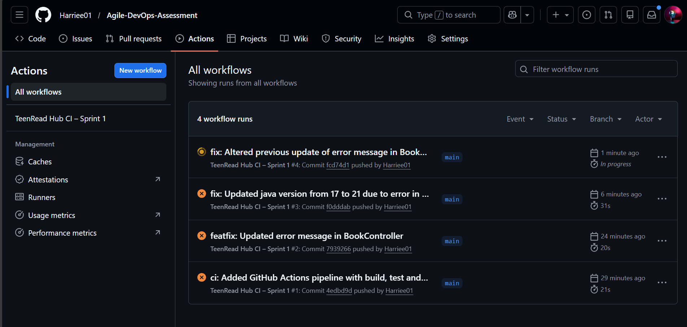
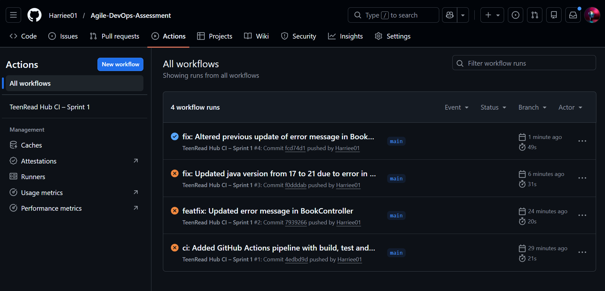
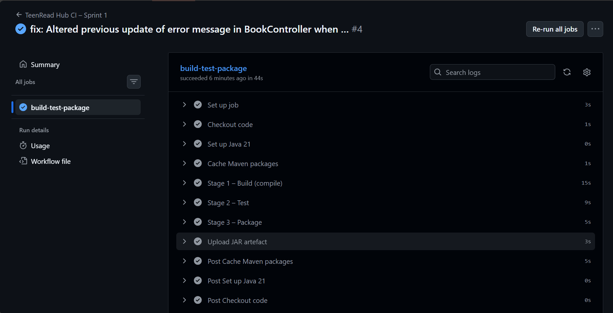

# Sprint 1 Review

## Sprint Goal

Deliver core read-only functionality for **TeenRead Hub**: browsing books, searching by title, and providing clear user feedback — all supported by a stable, green CI/CD pipeline.

---

## Completed Scope

Sprint 1 successfully delivered:

- **US1 – Browse Books**
- **US2 – Search Books**
- **US6 – Feedback Messages**

The application now:

- Exposes REST endpoints for listing and searching books
- Renders a responsive UI with accessible feedback messages
- Includes full unit and controller test coverage
- Passes all CI/CD stages (build, test, package) with no regressions

All items met the **Sprint 1 Definition of Done**.

---

## Outcome Summary

- Users can view a list of **12 seeded books** with availability status
- Users can search books by title with **case-insensitive** and **partial-match** functionality
- Clear **success, warning, and error** messages appear for all actions
- Automated tests validate service and controller behavior
- CI/CD pipeline is stable and produces a **deployable JAR artifact**

---

## Screenshot Evidence

### 1. Homepage – Browse Books View
Screenshot showing the landing page with the book grid and availability badges. 

### 2. Search Functionality – Results Found
Screenshot after entering a keyword that returns results.

### 3. Search Functionality – No Results Feedback
Screenshot showing empty results state and a feedback message.

### 4. CI/CD Pipeline 
The CI pipeline was introduced after the initial commits.
The first two pipelines failed because of a maven dependency which was not supported(jdk 21).
The third failed because of an exception error.

After fixing them, the pipeline dashboard with Build, Test and Package stages marked passed.

