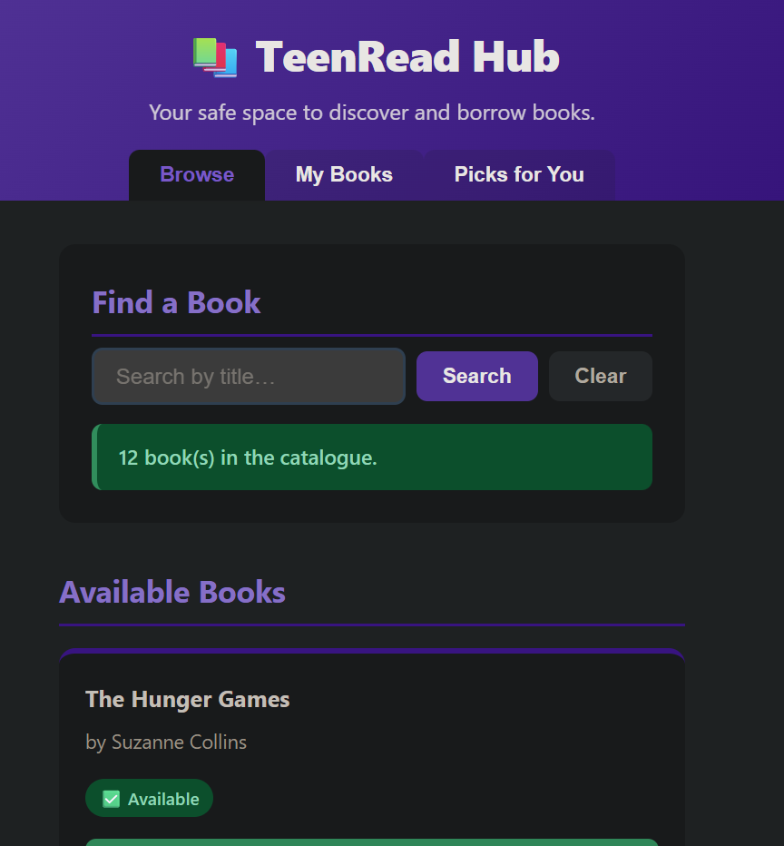
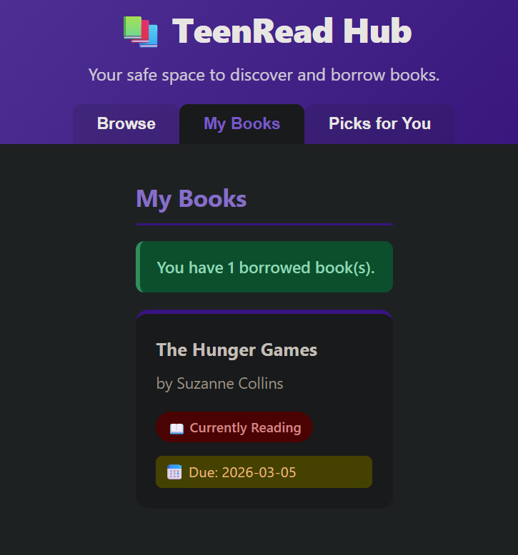
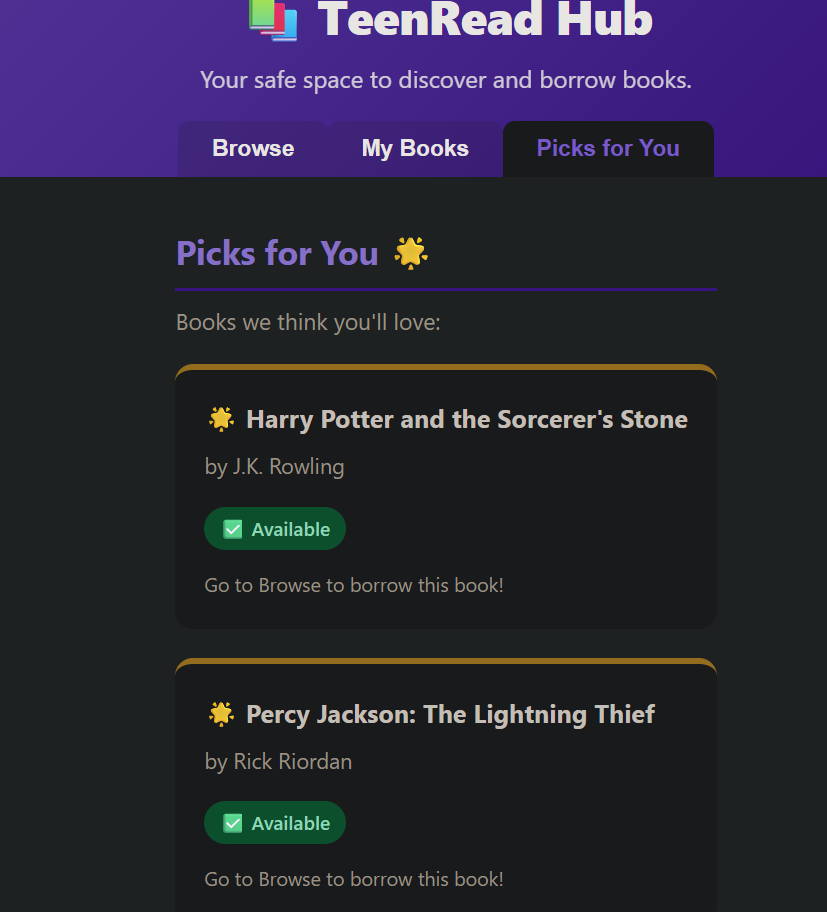
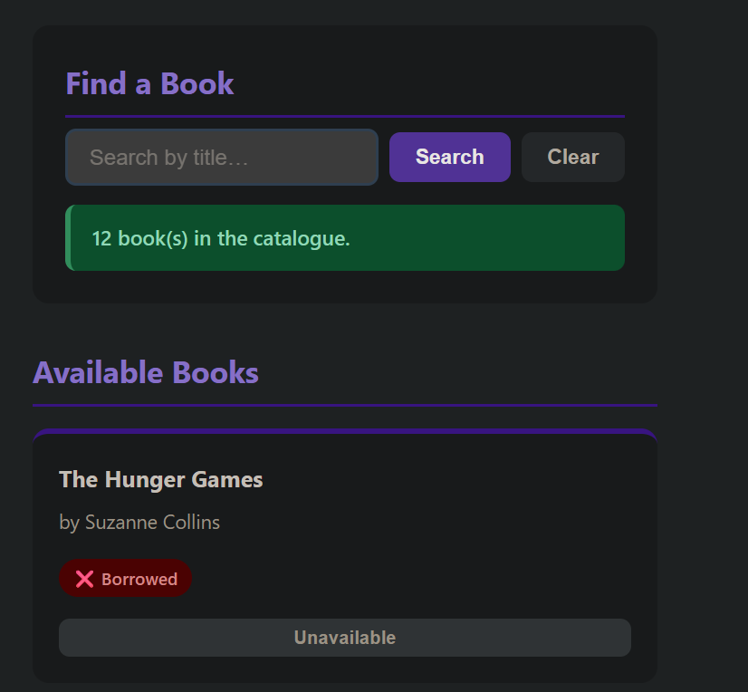
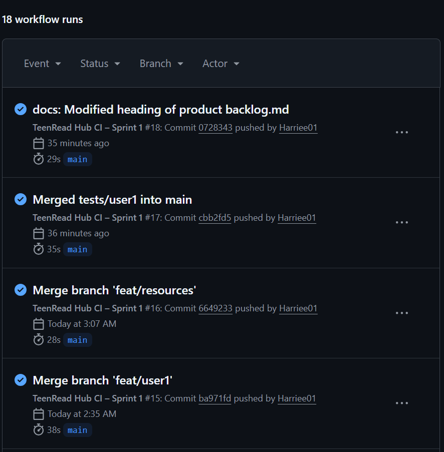

# Sprint 2 Review

## Sprint Goal

Complete all remaining core user journeys for TeenRead Hub (borrow books, view my books, recommendations, and health monitoring) while applying Sprint 1 retrospective improvements: test-first discipline and smaller, focused commits.

---

## Completed Scope

Sprint 2 successfully delivered:

- **US3 – Borrow Book**
- **US4 – My Books**
- **US5 – Recommendations**
- **Additional Health Monitoring Endpoint**

All features were implemented with tests written **before** feature code (TDD style), and validated through a CI/CD pipeline that showcased:

- An **intentional failing pipeline run** (demonstrating quality gates)
- A **successful green pipeline run** following fixes

---

## Outcome Summary

- Users can **borrow books** with strict availability rules and due date assignment
- Users can view all currently borrowed books via the **My Books** view
- Users receive simple, capped **book recommendations**
- System health and book statistics exposed via **`/health`**
- CI/CD pipeline enforces quality gates and blocks faulty logic before merge
- **47 automated tests** pass with **zero failures** on main

---

# Sprint 2 Screenshot Evidence

## 1. Borrow Book – Happy Path
Screenshot showing the main book list with a Borrow button.

## 2. My Books View
Screenshot of the My Books panel showing borrowed books with title, author, and due date.

## 3. Recommendations Panel
Screenshot showing up to the capped number of recommended books with gold-accent UI styling.

## 4. Successful borrowing

## 5. CI/CD Pipeline Passed

